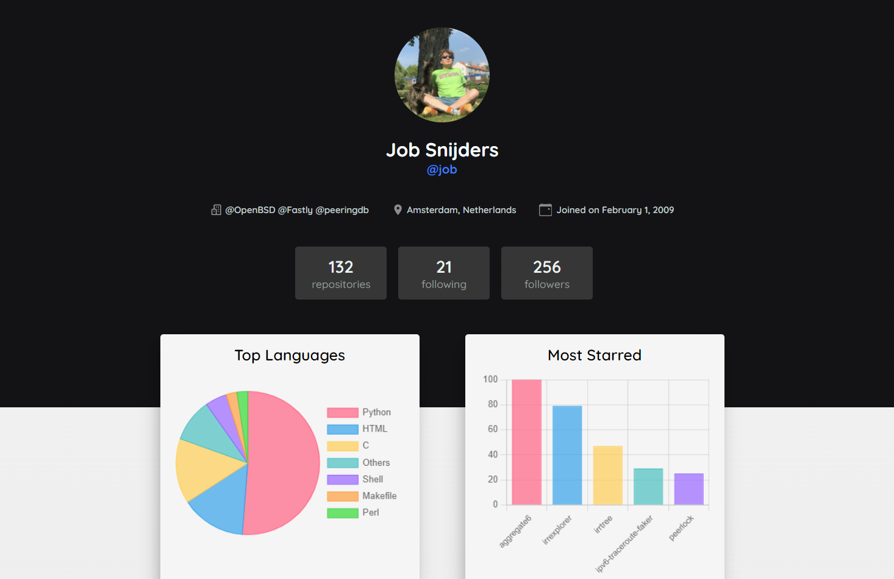

# [GithubSpy](https://githubspy.vercel.app/ 'visit website -->')

GithubSpy offers a nice visual of statistics about your GitHub profile. It is built with Next.js and is hosted on [Vercel](https://vercel.com/ 'visit vercel').

| :exclamation:  This is very important   |
|-----------------------------------------|

## About the API calls
The statistics that appear on the dashboard are fetched from several APIs listed here. I will not be specifying the results from those APIs, they all have good documentation.

* **GitHub Contribution Calendar API**: [https://gh-calendar.rschristian.dev/user](https://gh-calendar.rschristian.dev/user 'visit website -->')
* **Github API**: 
   - Get limit rate: [https://api.github.com/rate_limit](https://api.github.com/rate_limit 'visit website -->')
   - Get general information for a certain user: [https://api.github.com/users/](https://api.github.com/users/ 'visit website -->')
* **GhPolyglot**: get user top languages & top repositories
